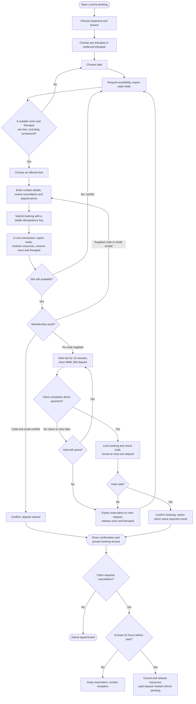

# Client booking flow

The diagram describes the implemented first cut. “Pay” is an explicitly labelled simulation; live provider integration remains a launch requirement. The database transaction, rather than the availability preview, decides whether a slot is still available. A [standalone SVG](booking-flow.svg) is also available for viewing without Mermaid support.

Room occupancy is `[start, treatment end + 15 minutes)`. Therapist occupancy is `[start, treatment end + therapist turnaround)`. These independent intervals explain why a senior facialist can work back to back while a room still requires cleaning.

No scheduled worker is required to release capacity: booking and availability requests apply expiry using server time. Expired rows may remain marked held until such a request, but they must not prevent an eligible new booking after cleanup.
