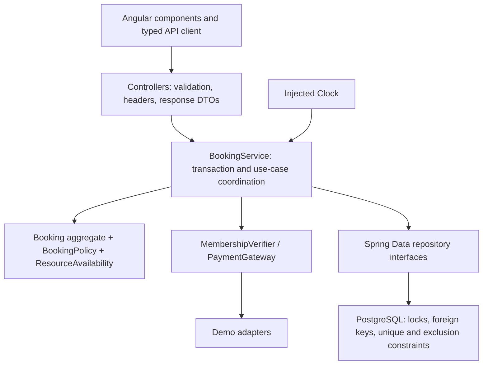
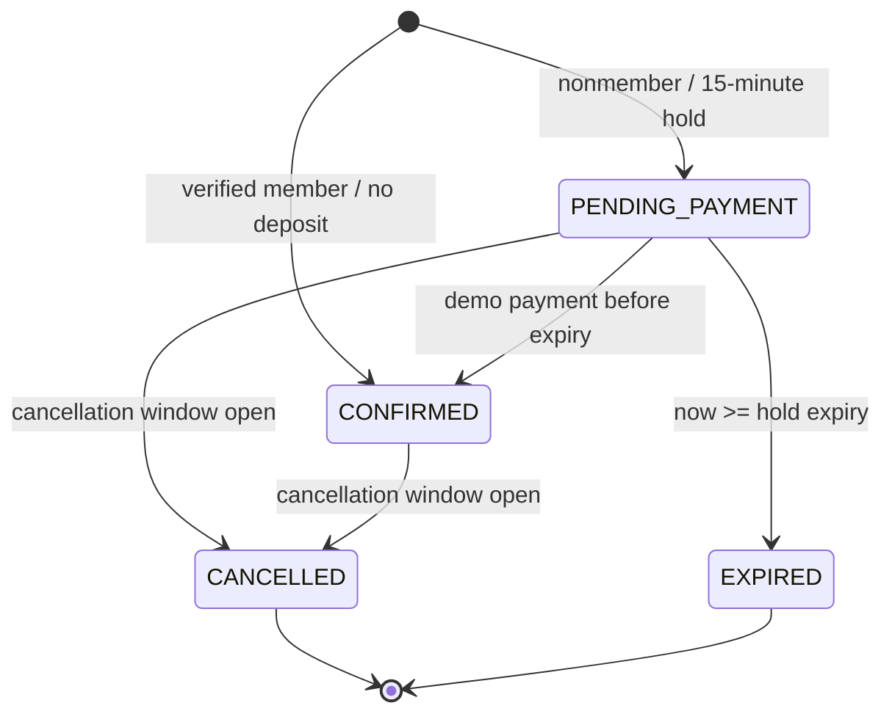
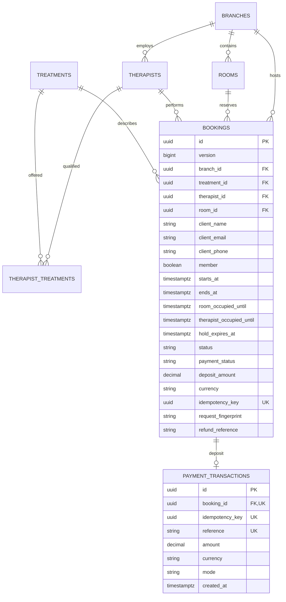

# Technical handover

## Runtime and structure

This is a Java 17 / Spring Boot 3.5 application with an Angular 22 client under `src/main/frontend`. The root Maven lifecycle installs a pinned Node/npm toolchain, runs `npm ci`, builds the frontend, runs frontend/backend tests and copies Angular's browser output into `BOOT-INF/classes/static` in the executable JAR. PostgreSQL is the only application datastore. Flyway owns the schema; Hibernate validates it instead of mutating it.



Code is grouped by domain feature (`booking`, `catalog`, `payment`) with cross-cutting `config` and `web` packages. Constructors make dependencies explicit. Entities do not serialize directly into API responses.

| OOP / SOLID choice | Concrete implementation and purpose |
|---|---|
| Encapsulation | `Booking.reserve`, `confirmPayment`, `cancel`, `expireIfNecessary` and `recordManualRefund` own state transitions; no public setters allow arbitrary status changes |
| Value object | `ClientDetails` groups normalized contact values independently of HTTP requests |
| Single responsibility | Controllers handle HTTP; policy handles business time; resource availability handles interval matching; the service coordinates persistence |
| Open/closed and dependency inversion | `MembershipVerifier` and `PaymentGateway` are narrow ports; demo adapters can be replaced without changing the resource allocator |
| Interface segregation | Membership verification and payment collection are separate contracts, with no oversized external-integration interface |
| Substitution | The application uses those contracts through constructor injection; the demo adapters honor their explicit return/error behaviour |
| Repository pattern | Spring Data interfaces separate persistence queries from application orchestration |
| Factory method | `Booking.reserve` creates a consistent member confirmation or nonmember hold and snapshots occupancy/deposit terms |
| Strategy / adapter | Demo membership/payment implementations sit behind replaceable interfaces |
| Deterministic time | An injected `Clock` makes hold and cancellation boundaries testable without sleeps |

There is an explicit booking state machine, not a class hierarchy for each state. Interfaces are introduced at actual variation points. A live payment provider will also need webhook/reconciliation orchestration; replacing the adapter alone is insufficient for real money.

## Business rules

Rule IDs are stable so the README can map each rule to exact source lines and test evidence.

| ID | Enforced behaviour | Main enforcement |
|---|---|---|
| R1 | A booking uses an existing branch, treatment, room and therapist; therapist and room belong to the branch, and the therapist is qualified for the treatment | `BookingService.create`; catalogue/repository lookups; schema composite foreign keys |
| R2 | Treatment durations are constrained to 30, 60 and 90 minutes; durations and deposit are taken from server data, never supplied prices | `Treatment`; migration constraints/seed; `Booking.reserve` |
| R3 | Starts are strictly in the future, on minute 00 or 30, with zero seconds/nanoseconds, through local today + 90 days inclusive | `BookingPolicy.validateStart`, `validateDate` |
| R4 | Branches open Monday–Saturday 09:00–18:00 Asia/Yangon; treatment and both turnaround intervals must finish by closing | `BookingPolicy.isOpen`, `fitsBusinessHours` |
| R5 | A room serves only one client, including 15 minutes of cleaning after every treatment | `ResourceAvailability.findRoom`; `Booking.reserve`; room overlap exclusion and cleaning check in SQL |
| R6 | A therapist serves only one client, including their own turnaround; normal seeded therapists get 15 minutes and the senior facialist gets 0 | `ResourceAvailability.findRoom`; therapist turnaround data; therapist overlap exclusion in SQL |
| R7 | Slot availability is rechecked inside a branch-locked transaction before reserving; two concurrent requests cannot both obtain the same overlapping resource | `BookingService.create`, `lockBranch`; `BranchRepository.findLockedById`; SQL exclusion constraints |
| R8 | Nonmembers reserve a 15-minute `PENDING_PAYMENT` hold with a MMK 300.00 deposit. Expiry at exactly the deadline releases both resources | `Booking.reserve`, `expireIfNecessary`; request-driven `BookingService.expireHolds` |
| R9 | Members pay no deposit only after server verification. A blank membership code is a nonmember; an incorrect supplied code/email is a 422 error | `DemoMembershipVerifier`; `Booking.reserve` |
| R10 | Booking creation requires a UUID idempotency key. Same key + same normalized payload returns the existing booking; changed payload conflicts | `BookingService.create`, `fingerprint`; unique `bookings.idempotency_key` |
| R11 | Payment requires private booking access and an active hold. At most one simulated deposit exists per booking, even with a different retry key; cross-booking reuse of a payment key conflicts | `BookingService.pay`; `Booking.confirmPayment`; unique booking/key/reference in `payment_transactions` |
| R12 | Online cancellation is allowed at exactly 24 hours before or earlier. It releases active resources; a paid deposit becomes `REFUND_PENDING`. A later request fails and retains the booking | `BookingPolicy.cancellationAllowed`; `Booking.cancel`; SQL active-state predicates |
| R13 | A staff member may mark only a cancelled, refund-pending booking refunded, with a nonblank reference; an identical retry returns the same result | `StaffBookingController.RefundRequest`; `Booking.recordManualRefund` |
| R14 | Private booking reads/payment/cancellation require the matching HMAC token. Every staff API requires the staff role; mutation requests require a CSRF token | `BookingTokenService.verify`; `SecurityConfiguration` |
| R15 | Only the documented input fields are accepted. Contact fields are bounded and validated; client ID number and date of birth are neither accepted nor stored | `CreateBookingRequest`; `ClientDetails`; Jackson unknown-property rejection; schema |

MMK and Asia/Yangon (UTC+06:30) reflect the requested Myanmar settings. The currency, time zone, hours, 90-day horizon and hold length are centralized constants in `BookingPolicy`, not advertised environment settings. All seeded branch rooms are assumed suitable for all seeded treatments. Equipment compatibility, roster exceptions and branch-specific hours require new policy/data before a real rollout.

## Availability and concurrency

For a treatment starting at `s` with duration `d`, the room interval is `[s, s + d + 15 minutes)` and the therapist interval is `[s, s + d + therapist.turnaround)`. Two intervals overlap exactly when `a.start < b.end && b.start < a.end`. Half-open intervals permit adjacency after cleanup finishes.

A 09:00–10:00 treatment occupies its room until 10:15, so the next grid-aligned use of that room is 10:30. The senior facialist can begin at 10:00 in another clean room, but cannot reuse the room still being cleaned. Other therapists with 15 minutes turnaround can next start at 10:30.

Availability enumerates half-hour candidates, filters qualified therapists at the chosen branch, verifies the opening window and chooses a free room against active reservations. An “any therapist” search returns options per eligible therapist; the selected concrete therapist ID is submitted to create. The preview does not reserve capacity.

`BookingService` acquires a pessimistic write lock on the branch row before expiry, reads or mutations of reservation capacity. For six branches this provides simple, deliberate serialization per branch; separate branches may progress independently. The cross-branch staff diary acquires locks in sorted ID order. This is coarse locking and a throughput tradeoff, not unlimited scalability.

The database provides a second layer: `bookings_no_room_overlap` and `bookings_no_therapist_overlap` exclude overlapping `tstzrange` values for `PENDING_PAYMENT` and `CONFIRMED` rows. Composite foreign keys enforce branch/resource consistency and therapist qualification. Application conflicts and database integrity conflicts are returned as HTTP 409. PostgreSQL's supported `btree_gist` extension enables scalar IDs in these exclusion constraints. [PostgreSQL exclusion-constraint documentation](https://www.postgresql.org/docs/17/ddl-constraints.html#DDL-CONSTRAINTS-EXCLUSION).

Expired holds are updated and flushed before inserting replacement reservations, removing them from the exclusion predicate. Availability, creation, private reads, payments, cancellations and staff-diary reads all apply expiry under the branch lock. `noRollbackFor=DomainException.class` intentionally preserves expiry changes even if a request is then rejected by a business rule. Database failures still roll back normally. Do not add partial business mutations followed by a domain exception without reviewing this boundary.

There is no scheduler. With no traffic, a stale row may remain `PENDING_PAYMENT`; the next relevant request expires it before capacity is evaluated. This satisfies the brief's no-background-jobs constraint for booking correctness, but it does not send expiry notifications.

## Booking and payment state



Payment state is separate: members begin `NOT_REQUIRED`, nonmembers `UNPAID`; successful simulation becomes `PAID`; eligible paid cancellation becomes `REFUND_PENDING`; staff recording a manual refund reference becomes `REFUNDED`. Cancelling an already-cancelled booking is idempotent. The manual refund endpoint records an operational acknowledgement; it does not transfer funds.

The create fingerprint hashes length-prefixed, normalized request fields using SHA-256. A lost response can be retried with the same key without a second reservation. Keep the original key after a network timeout. A deliberately changed booking request needs a new key. A terminal booking is still returned on replay; rebooking requires a fresh key and capacity check.

The demo payment ledger has unique booking ID, idempotency key and receipt reference. Branch serialization protects concurrent payment and cancellation paths; retries return the original receipt. The `DemoPaymentGateway` creates deterministic receipts without contacting a provider. Do not call this “exactly once” charging in a distributed system. A real gateway needs provider-side idempotency, signed webhooks, durable event deduplication and late-payment/refund reconciliation across database/gateway failures.

## Data model



Booking rows snapshot end/turnaround times and deposit terms, so changing catalogue data does not retroactively change occupied intervals. Client contact information is embedded per booking; there is no clinical-patient record or general membership table. Times are Java `Instant` / PostgreSQL `timestamptz`; API offsets and displayed times use the explicit clinic zone. Currency uses `BigDecimal`/SQL numeric, not floating point. IDs and request keys are UUIDs. `@Version` additionally guards stale entity writes.

Flyway migrations live in `src/main/resources/db/migration`; the initial schema creates constraints and indexes, the seed migration inserts fictional catalogue data, and V3 restricts treatment durations to the three supported values. Add a new migration for a change that has already been applied; do not edit an existing migration on a deployed database. Back up before migrations and rehearse restoration.

## HTTP contract

All routes share the Angular origin. Mutations require the XSRF cookie/token handshake in addition to the authorization shown below. Dates use `YYYY-MM-DD`; appointment starts use an ISO-8601 offset date-time.

| Method and path | Purpose / required access |
|---|---|
| `GET /api/csrf` | Establish the `XSRF-TOKEN` cookie before POST requests |
| `GET /api/catalog` | Branches, treatment durations/prices, therapist qualifications, zone and deposit policy |
| `GET /api/availability?branchId=…&treatmentId=…&date=…&therapistId=…` | Available concrete therapist/time combinations; therapist filter optional |
| `POST /api/bookings` | Create using `Idempotency-Key: <UUID>` |
| `GET /api/bookings/{id}` | Retrieve with `X-Booking-Token` |
| `POST /api/bookings/{id}/payments` | Simulate payment with `X-Booking-Token` and `Idempotency-Key` |
| `POST /api/bookings/{id}/cancel` | Cancel with `X-Booking-Token` |
| `GET /api/staff/bookings?date=…&branchId=…` | Basic authentication, staff role; branch filter optional |
| `POST /api/staff/bookings/{id}/refund` | Staff role; body `{"reference":"manual-refund-reference"}` |
| `GET /actuator/health` | Public health status with database readiness, without diagnostic details |

Example create body (replace sample IDs and use a future offered slot):

```json
{
  "branchId": "00000000-0000-0000-0000-000000000001",
  "treatmentId": "00000000-0000-0000-0000-000000000002",
  "therapistId": "00000000-0000-0000-0000-000000000003",
  "startsAt": "2026-10-01T10:00:00+06:30",
  "client": {"name": "Demo Client", "email": "demo@example.com", "phone": "+95 9 123 456 789"},
  "membershipCode": null
}
```

Client code first calls `/api/csrf`; Angular's built-in same-origin XSRF support echoes the cookie as `X-XSRF-TOKEN` on mutations. API clients must preserve that cookie and supply the header too. HTTP Basic is used only for the staff endpoints and must be carried over HTTPS on deployment. Errors use `application/problem+json` with a stable `code`, `status`, `detail` and optional `fieldErrors`; SQL and sensitive parameters are not included in responses.

## Security and operational boundaries

Booking management uses an HMAC-SHA256 capability derived from the booking UUID and server secret, compared in constant time. The UUID alone grants no private access. Tokens are sent in a header and must be treated as bearer secrets. This first cut has no token expiry, individual revocation or authenticated client-account recovery; changing the master secret invalidates existing derived tokens.

Production startup rejects short/default credentials. Staff passwords are encoded with BCrypt in the in-memory account store. Browser protections include CSRF, content security policy, frame blocking and a no-referrer policy. Angular critical CSS inlining is disabled so styles load through a normal stylesheet link without a CSP-blocked inline onload handler. Browser regression tests verify applied styles and reject console errors. Unknown JSON fields are rejected. Ordinary API requests with a declared body over 32 KB are rejected; a proxy/body streaming limit is still needed to bound chunked requests. Rate limiting, individual staff identity/MFA, a durable audit log, retention/deletion workflows and clinical consent remain unfinished.

The Spring runtime serves static frontend assets and the API; PostgreSQL persists bookings independently of container restarts. The deployment guide specifies a nonroot container, JVM memory budget, verified database TLS and health checks. The application performs no payment notifications or scheduled reminders. Record test evidence, operational limitations and actual deployment status in the README, and complete the [launch work](assumptions-and-delivery.md) before accepting real clients.

## Myanmar locale upgrade

Migration V4 renames the six existing demo branch records to Yangon locations by stable ID. Earlier migrations remain unchanged so an existing installation can upgrade with valid Flyway checksums. Appointment instants remain stored as PostgreSQL `timestamptz`; the API projects them into `Asia/Yangon`. Angular shares a `+0630` DatePipe default and uses the IANA zone for calendar dates, independent of server and browser defaults. Browser tests run in America/New_York to exercise that separation.

New bookings snapshot MMK and the 300 deposit. Existing booking and payment snapshots retain their original currency, amounts and instants, including any legacy THB records. This is a demo currency configuration change, with no exchange-rate conversion or rescheduling. Treatment prices retain their illustrative numeric values (900, 1,600 and 2,400), quoted in MMK for new bookings.
